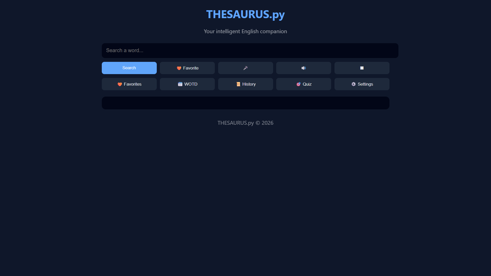
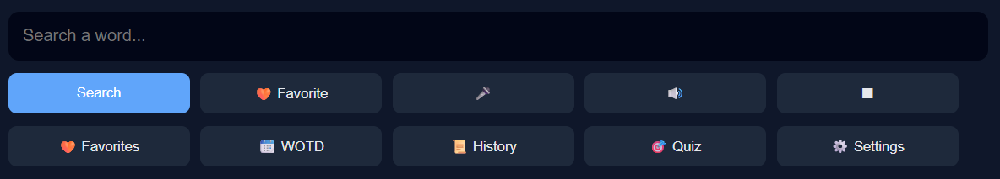
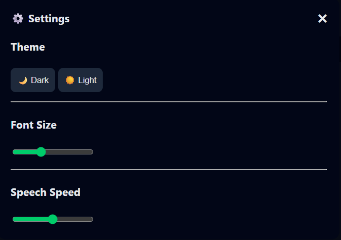

# THESAURUS.py

A modern, interactive English Thesaurus web application built with Python and Flask.  
Designed with a clean UI, smooth animations, and smart features to help users explore English vocabulary effortlessly.

---

## ✨ Features

- 🔍 **Word Search**
  - Meanings
  - Parts of Speech
  - Synonyms & Antonyms
  - Example sentences
  - Word forms

- 🎤 **Voice Input**
  - Search words using speech

- 🔊 **Talk Back**
  - Text-to-speech pronunciation with adjustable speed

- 📆 **Word of the Day**
  - Discover a new word instantly

- 🧠 **Vocabulary Quiz**
  - Multiple-choice quiz
  - Instant feedback
  - Accuracy tracking

- 🧡 **Favorites**
  - Save favorite words
  - Stored per browser (no login required)

- 📜 **Search History**
  - Separate history for each browser/user

- ⚙️ **Settings**
  - Dark / Light theme
  - Font size control
  - Speech speed control
  - Preferences saved locally

- 🎬 **Premium UI & UX**
  - Animated splash screen
  - Parallax depth effect
  - Smooth modal windows
  - Page entrance animations

---

## 🛠 Tech Stack

- **Backend:** Python, Flask
- **Frontend:** HTML, CSS, JavaScript
- **NLP:** NLTK (WordNet)
- **Storage:** Browser LocalStorage
- **Deployment Ready:** Gunicorn, Railway / Render

---
---

## 📸 Screenshots

### 🏠 Home & Search


### 🔍 Word Details


### 🎯 Vocabulary Quiz


### ⚙️ Settings Panel


## 🚀 Getting Started (Local Setup)

### 1️⃣ Clone the repository
```bash
git clone https://github.com/coder-sohail/thesaurus.py
cd english-thesaurus-final

